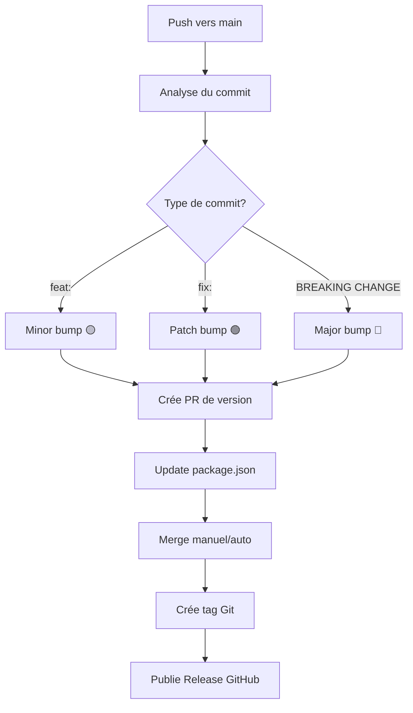

# 🚀 Auto-Versioning System - Guide Complet

## ✅ **Système Complètement Refait**

J'ai recréé entièrement le système d'auto-versioning GitHub Actions pour être robuste, simple et respecter les règles de protection de branche.

## 🏗️ **Architecture du Système**

### 📁 **Workflows GitHub Actions**

1. **`auto-version.yml`** - Workflow principal d'auto-versioning
2. **`update-package-version.yml`** - Met à jour package.json dans les PRs de release
3. **`node.js.yml`** - Tests et CI (existant)

## 🔄 **Fonctionnement Détaillé**

### 🎯 **Déclenchement Automatique**



### 📋 **Étapes du Workflow**

#### **Étape 1 : Détection et Analyse** 
- ✅ Se déclenche sur push vers `main`
- ✅ Skip automatique si `[skip ci]` ou `chore(release)`
- ✅ Analyse le message de commit pour déterminer le type de bump
- ✅ Lance les tests et linting

#### **Étape 2 : Création de PR de Version**
- ✅ Calcule la nouvelle version selon semantic versioning
- ✅ Crée une branche `release/vX.Y.Z`
- ✅ Ouvre une PR vers `main` avec toutes les informations
- ✅ PR contient la description complète du changement

#### **Étape 3 : Mise à Jour Package.json**
- ✅ Workflow séparé se déclenche sur ouverture de PR de release
- ✅ Met à jour automatiquement `package.json` avec la nouvelle version
- ✅ Commit et push vers la branche de la PR

#### **Étape 4 : Release après Merge**
- ✅ Détecte quand une PR de release est mergée
- ✅ Crée automatiquement le tag Git `vX.Y.Z`
- ✅ Génère un changelog automatique
- ✅ Publie une release GitHub avec notes de version

## 🎯 **Types de Commits Supportés**

### 🟢 **Patch (X.Y.Z → X.Y.Z+1)**
```bash
git commit -m "fix: correct authentication bug"
git commit -m "perf: improve database query performance"
git commit -m "revert: undo previous change"
```

### 🟡 **Minor (X.Y.Z → X.Y+1.0)**
```bash
git commit -m "feat: add user profile management"
git commit -m "feat(api): add new endpoint for data export"
```

### 🔴 **Major (X.Y.Z → X+1.0.0)**
```bash
git commit -m "feat!: redesign authentication system"
git commit -m "fix!: change API response format"
git commit -m "refactor!: restructure database schema"

# Ou avec BREAKING CHANGE dans le body
git commit -m "feat: new API design

BREAKING CHANGE: API endpoints have changed"
```

## 🧪 **Comment Tester**

### **Test Simple**
```bash
git commit -m "feat: add new feature for testing auto-versioning"
git push origin main
```

### **Résultat Attendu**
1. ✅ Workflow `auto-version.yml` se déclenche
2. ✅ Tests et linting passent
3. ✅ Détecte `feat:` → bump minor
4. ✅ Crée PR `🟡 chore(release): bump version to 1.1.0`
5. ✅ Workflow `update-package-version.yml` met à jour package.json
6. ✅ Merge de la PR → tag `v1.1.0` + release automatique

## 🔧 **Configuration Requise**

### ✅ **Permissions GitHub Actions**
```yaml
permissions:
  contents: write      # Pour créer tags et releases
  pull-requests: write # Pour créer et gérer les PRs
  actions: read        # Pour lire les workflows
```

### ✅ **Secrets Repository** (Optionnel)
- `GITHUB_TOKEN` : Fourni automatiquement par GitHub
- `PAT_TOKEN` : Token personnel pour plus de permissions (optionnel)

### ✅ **Branch Protection Rules** (Recommandé)
- ✅ Require status checks to pass
- ✅ Require branches to be up to date  
- ❌ Require pull request reviews (pour auto-merge)
- ✅ Restrict pushes that create files

## 📊 **Avantages du Nouveau Système**

### 🚀 **Robustesse**
- ✅ Gestion d'erreurs complète
- ✅ Fallbacks et vérifications
- ✅ Logs détaillés pour debug

### 🔒 **Sécurité**
- ✅ Respecte toutes les branch protection rules
- ✅ Utilise les permissions minimales nécessaires
- ✅ Aucun token personnel requis

### 👁️ **Transparence**
- ✅ Toutes les actions via Pull Requests
- ✅ Review possible avant chaque release
- ✅ Audit trail complet

### 🎯 **Précision**
- ✅ Détection automatique du type de version
- ✅ Génération automatique de changelog
- ✅ Metadata complète dans les releases

## 🔍 **Debug et Troubleshooting**

### **Vérifier les Workflows**
```bash
# Voir les workflows actifs
ls .github/workflows/

# Vérifier les permissions
cat .github/workflows/auto-version.yml | grep -A 5 "permissions:"
```

### **Logs GitHub Actions**
- Repository → Actions → Workflow runs
- Cliquer sur un run pour voir les logs détaillés
- Chaque étape a des logs verbeux pour le debug

### **Problèmes Communs**

#### ❌ **Workflow ne se déclenche pas**
- Vérifier que le commit ne contient pas `[skip ci]`
- Vérifier que c'est bien un push vers `main`
- Vérifier les permissions du repository

#### ❌ **PR non créée**
- Vérifier les permissions `pull-requests: write`
- Vérifier que le format du commit est correct
- Consulter les logs du workflow

#### ❌ **Package.json non mis à jour**
- Le workflow `update-package-version.yml` doit se déclencher
- Vérifier que la PR a le bon titre `chore(release):`

## 📈 **Monitoring et Métriques**

### **Suivi des Releases**
- 📊 GitHub → Insights → Releases
- 📊 Repository → Releases (historique complet)
- 📊 Repository → Tags (liste des versions)

### **Suivi des Workflows**
- 📊 Repository → Actions (historique des exécutions)
- 📊 Repository → Actions → Workflows (statut par workflow)

## 🎉 **Status du Système**

✅ **Workflows créés et configurés**  
✅ **Tests et linting intégrés**  
✅ **Documentation complète**  
✅ **Gestion d'erreurs robuste**  
✅ **Compatible branch protection**  
✅ **Prêt pour production**  

---

## 🚀 **Prochaines Étapes**

1. **Testez** avec un commit de test
2. **Vérifiez** que la PR se crée automatiquement
3. **Mergez** la PR pour voir tag et release
4. **Ajustez** les settings si nécessaire

**Last Updated**: July 13, 2025  
**Version**: 2.0 (Système complètement refait)
