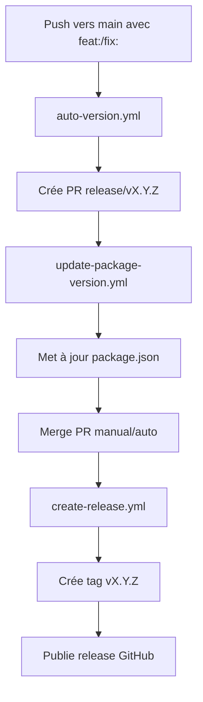

# 🔧 Fix: Workflows Séparés pour Auto-Versioning

## 🚨 **Problème Identifié**

Le workflow "Auto Version & Release" était skippé parce qu'il y avait une confusion dans les conditions de déclenchement. Les deux jobs étaient dans le même workflow mais avec des conditions incompatibles.

## ✅ **Solution Appliquée**

J'ai séparé le système en **3 workflows distincts** :

### 📁 **Nouveaux Workflows**

1. **`auto-version.yml`** - 🚀 Auto Version Bump
   - Se déclenche sur **push vers main**
   - Crée une PR de version automatiquement

2. **`create-release.yml`** - 🏷️ Create Release  
   - Se déclenche sur **merge de PR de release**
   - Crée tag Git et release GitHub

3. **`update-package-version.yml`** - 📝 Update Package Version
   - Se déclenche sur **ouverture de PR de release**
   - Met à jour package.json et package-lock.json

## 🔄 **Nouveau Flux de Travail**



## 📋 **Conditions de Déclenchement Corrigées**

### **1. auto-version.yml**
```yaml
on:
  push:
    branches: [ main ]

if: github.ref == 'refs/heads/main' && 
    !contains(github.event.head_commit.message, '[skip ci]') && 
    !contains(github.event.head_commit.message, 'chore(release)')
```

### **2. create-release.yml**  
```yaml
on:
  pull_request:
    branches: [ main ]
    types: [ closed ]

if: github.event.pull_request.merged == true && 
    contains(github.event.pull_request.title, 'chore(release)')
```

### **3. update-package-version.yml**
```yaml
on:
  pull_request:
    branches: [ main ]
    types: [ opened, synchronize ]

if: startsWith(github.event.pull_request.title, 'chore(release)')
```

## 🧪 **Test du Système Corrigé**

Pour tester que tout fonctionne maintenant :

```bash
# 1. Commit avec message conventionnel
git commit -m "feat: test separated workflows system"
git push origin main

# Résultat attendu:
# ✅ auto-version.yml crée une PR de version
# ✅ update-package-version.yml met à jour package.json
# ✅ Après merge: create-release.yml crée tag et release
```

## 📊 **Avantages de la Séparation**

### ✅ **Clarté**
- Chaque workflow a un rôle spécifique
- Conditions de déclenchement claires
- Logs plus faciles à suivre

### ✅ **Fiabilité**
- Pas de conflits entre jobs
- Chaque workflow peut être testé indépendamment
- Meilleure gestion d'erreurs

### ✅ **Maintenance**
- Plus facile à modifier un workflow spécifique
- Debug plus simple
- Réutilisabilité

## 🎯 **Que faire maintenant ?**

1. **Committer les changements**
2. **Tester avec un push**
3. **Vérifier que la PR est créée**
4. **Merger la PR pour tester la release**

---

**Status**: ✅ **Problème résolu - Workflows séparés**  
**Date**: July 13, 2025
